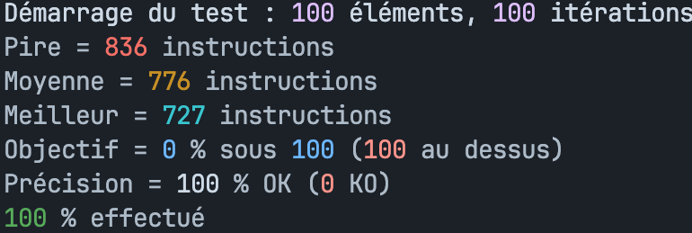
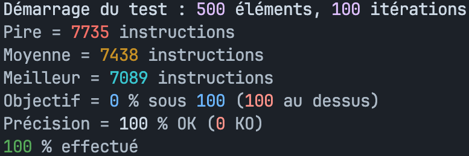

# 42 Push_swap
<p float='left' align='center'>

<p>

## About
The aim of this project is to sort a list of integers using two stacks and a set of operations. The list is initially given as arguments to the program, with the first argument being at the top of the stack. The operations that can be performed are as follows:

* **sa** - swap the first two elements of stack A
* **sb** - swap the first two elements of stack B
* **ss** - do **sa** and **sb** at the same time
* **pa** - move the first element from stack B to the top of stack A
* **pb** - move the first element from stack A to the top of stack B
* **ra** - rotate stack A so that the first element becomes the last
* **rb** - rotate stack B so that the first element becomes the last
* **rr** - do **ra** and **rb** at the same time
* **rra** - reverse rotate stack A so that the last element becomes the first
* **rrb** - reverse rotate stack B so that the last element becomes the first
* **rrr** - do **rra** and **rrb** at the same time

The goal is to sort the list of integers using the minimum number of operations. The program must output the list of operations to perform in order to sort the list.

## Gettin Started
First, clone the repository:
```` bash
git clone git@github.com:ltrinchini/PushSwap.git && cd PushSwap
````

Then, compile the program by running:
```` bash
make
````

## Usage
To sort a list of integers, run the `push_swap` program with the list of integers as arguments:
```` bash
./push_swap 4 67 3 87 23
````

## Scores

<div style="display: flex; justify-content: center; align-items: center;">
  
  
</div>

